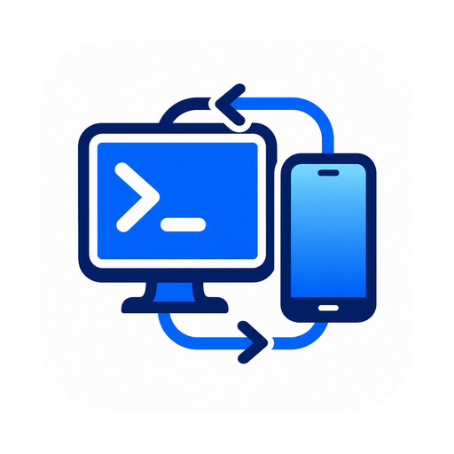

# Codex Remote Win

<p align="center">
  
</p>

一个面向 Windows Codex Desktop 的轻量远程控制桥接程序。它在电脑上启动本地 Web 服务，让手机或其他设备通过浏览器查看 Codex 任务、发送消息和附件，并进行常用的任务管理操作。

> 本项目不是 OpenAI 官方产品，也不是 Codex Mini 的官方 Windows 版本。

## Windows 客户端

- [下载 v0.11.0-beta.8 测试版 EXE](https://github.com/fangxinbuzaijia/CodexRemoteWin/releases/download/v0.11.0-beta.8/CodexRemoteWin.exe)
- [下载 v0.10.4 旧版 EXE](https://github.com/fangxinbuzaijia/CodexRemoteWin/releases/download/v0.10.4/CodexRemoteWin.exe)
- [查看全部版本和校验文件](https://github.com/fangxinbuzaijia/CodexRemoteWin/releases)
- 仓库中的 `client/CodexRemoteWin.exe` 对应 v0.11.0-beta.8 测试版。

## 功能

- 响应式手机和桌面网页界面
- 可切换浅色/深色模式，并在浏览器中记住选择
- 在网页顶栏显示 Codex 可用额度，展开查看各额度窗口和重置时间
- 读取并按项目整理本机 Codex 任务
- 从桌面端读取任务和运行状态，并在桌面历史接口返回空回合时从同一任务的本机记录补全对话
- 对话区只显示用户与 Codex 的文字消息，隐藏工具调用和文件操作记录
- 向指定任务发送文字消息
- 上传图片、文本、Office 文档、PDF、压缩包等附件
- 在指定项目新建任务，选择项目目录或 Git 工作树，并提交第一条消息
- 重命名、置顶、归档和恢复任务后读回桌面端状态
- 消息编号去重、持久回执、失败手动重试及不确定结果查询
- 运行中的 Codex 回复定时追加到消息流，成功回执自动收起
- 逐个上传附件、显示进度，历史附件可预览或下载
- 按任务保存草稿，切换任务时丢弃过期的历史请求
- 六位配对码和浏览器会话令牌
- 支持 `0.0.0.0` 监听，可由 OpenWrt 上的 FRP 客户端转发
- Windows 托盘运行，无控制台黑框
- Windows 托盘右键菜单、配对信息和开机启动提示使用中文
- 可从托盘菜单设置开机启动
- 单文件 Windows 可执行程序，无运行时依赖

## 系统要求

- Windows 10 或 Windows 11（x64）
- 已安装并登录提供本地 app-tools 接口的新版 ChatGPT/Codex Desktop
- 桌面端保持运行，并至少打开过一个本机 Codex 任务

## v0.11 测试版说明

本版本更换了桌面连接方式，已在 Windows 客户端 `26.901.5280.0` 上验证自动发现连接、读取任务和项目。发送、新建、任务操作和附件流程通过模拟桌面的自动化回归测试，仍需在你的实际任务中完成使用验证。

- 仅展示本机 Codex 任务；当前桌面接口每次最多返回 50 个最近任务及全部置顶任务，归档页暂取最近 50 个。
- 附件上传到本机后，以文件路径清单随消息交给 Codex 读取。图片可由 Codex 的图片读取工具查看；这不等于桌面输入框中的原生图片附件卡片。
- 一条消息最多 6 个附件，每个最多 12 MB。附件逐个传输，不再放进一个 Base64 消息请求中。
- 附件和回执保存在 `data/attachments`、`data/deliveries`，升级时保留整个 `data` 目录。该版本不会自动清理新附件。
- 看到“结果待确认”时先查询回执或检查桌面任务，不要另发一条相同消息。程序重启后也不会自动重放未确认消息。
- 当前连接方式暂不提供停止任务、模型切换、单个任务的上下文用量、SSH 任务或逐字推送。账户额度可以在顶栏查看；回复与进度定时更新，停止操作请在桌面完成。
- 桌面内部接口可能随版本变化；连接不可用时网页会明确报错，不会用历史日志冒充当前任务列表。

## 快速使用

1. 从 [Releases](https://github.com/fangxinbuzaijia/CodexRemoteWin/releases) 下载 `CodexRemoteWin.exe`。
2. 运行程序。程序会进入系统托盘，不显示控制台窗口。
3. 打开托盘菜单查看配对码和访问地址。
4. 在手机浏览器访问 `http://电脑局域网IP:8787`。
5. 首次访问输入配对码，之后即可选择任务并发送消息。

默认监听地址为 `0.0.0.0:8787`。可以通过环境变量覆盖：

```powershell
$env:CODEX_REMOTE_HOST = '0.0.0.0'
$env:CODEX_REMOTE_PORT = '8787'
$env:CODEX_REMOTE_PAIR_CODE = '123456'
.\CodexRemoteWin.exe
```

可用变量：

| 变量 | 默认值 | 说明 |
| --- | --- | --- |
| `CODEX_REMOTE_HOST` | `0.0.0.0` | Web 服务监听地址 |
| `CODEX_REMOTE_PORT` | `8787` | Web 服务端口 |
| `CODEX_REMOTE_PAIR_CODE` | 随机六位数 | 固定配对码 |
| `CODEX_REMOTE_CONTEXT_THREAD` | 自动选择已有任务 | 桌面连接所需的本机任务上下文，通常无需设置 |
| `CODEX_REMOTE_DESKTOP_PIPE` | 自动探测 | 排查桌面版本兼容问题时可指定本机管道 |

## OpenWrt + FRP

当 `frpc` 运行在 OpenWrt 路由器上时，`local_ip` 应填写 Windows 电脑的局域网 IP，而不是 `127.0.0.1`：

```toml
[[proxies]]
name = "codex-remote-win"
type = "tcp"
localIP = "192.168.6.158"
localPort = 8787
remotePort = 18787
```

上面的 IP 和端口只是示例，请替换为自己的网络配置。

## 安全说明

程序默认监听所有网卡，这是为了支持局域网和路由器上的 FRP 客户端。不要把裸露的 `8787` 端口直接映射到公网。

推荐至少采取以下措施：

- 在 FRP 服务端启用 TLS 和身份认证
- 通过 HTTPS 反向代理访问
- 使用防火墙限制来源 IP
- 不要使用简单或长期不变的固定配对码
- 清理附件前先备份需要保留的文件；删除整个 `data` 会同时丢失回执和配对信息

浏览器会话令牌保存在浏览器本地存储中，服务端只保存令牌哈希。运行数据默认位于 EXE 同目录的 `data` 文件夹，该目录不会提交到 Git。

## 从源码构建

需要 Go 1.22 或更高版本，并在 Windows x64 环境运行：

```powershell
git clone https://github.com/fangxinbuzaijia/CodexRemoteWin.git
cd CodexRemoteWin
.\build.ps1
```

生成文件位于 `dist/CodexRemoteWin.exe`。构建脚本会自动生成 Windows 图标资源；本地存在 `tools/rsrc.exe` 时直接使用，否则会按固定版本下载并运行资源工具。

## 工作原理

程序通过本机命名管道连接桌面端的 app-tools 接口，读取真实任务和项目，并提交文字消息与任务操作。附件先保存在本机，再将路径交给任务。每次发送在调用桌面前保存记录，得到桌面响应后更新回执；连接中断后可用任务日志中新增的消息辅助确认。

桌面端关闭、接口不兼容或调用被桌面端拒绝时会显示错误。网页认证仍由本程序负责，不会关闭桌面端自身的权限或确认机制。

## 上游与许可

本项目在产品思路和交互流程上参考了 [CoimgRain/Codex-Mini](https://github.com/CoimgRain/Codex-Mini)，并为 Windows、系统托盘、OpenWrt/FRP 和单文件 EXE 场景重新实现。

依照上游许可要求，本项目采用 [Codex Mini Source-Available Non-Commercial License 1.0](LICENSE)：允许个人、教育、研究、评估等非商业用途；商业使用需要获得原版权所有者的书面授权。
